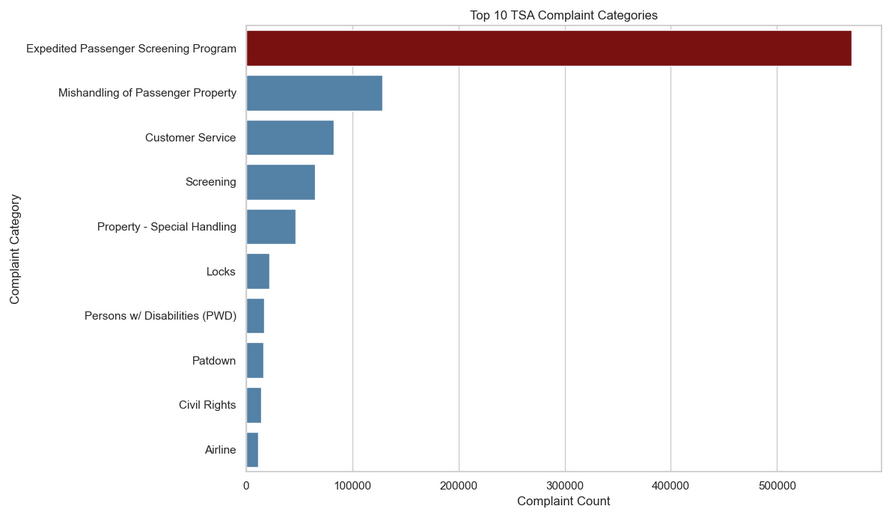

# TSA Complaints Analysis

## Project overview

This project examines patterns in Transportation Security Administration (TSA) complaint counts across airports, complaint categories, and time. It is intended to help operational leaders identify where a closer review of traveler concerns may be useful.

The analysis uses Python to prepare the data and create charts showing complaint trends, high-volume airports and categories, and the geographic distribution of complaints.

## Questions explored

- How has complaint volume changed over time?
- Which airports and complaint categories have the highest recorded counts?
- How do complaint counts vary across years and locations?
- Where might a targeted operational review be useful?

## Approach

The Jupyter notebook loads complaint counts by airport, category, and subcategory, along with an airport-code lookup file. It standardizes dates and airport codes, joins airport information for mapping, and produces time-series, bar, heat-map, distribution, and geographic visualizations.

## Main takeaway

Complaint counts are concentrated among certain airports and categories and vary over time. These patterns can help prioritize further investigation. A high count alone does not establish poor performance: airports differ in passenger volume, and the dataset does not show whether individual complaints were substantiated.



## Repository contents

| Path | Contents |
|---|---|
| [`analysis/TSA_Complaints_Analysis.ipynb`](analysis/TSA_Complaints_Analysis.ipynb) | Data preparation, charts, interpretation, and recommendations |
| [`data/`](data/) | Complaint datasets and airport-code lookup |
| [`images/`](images/) | Exported project visualizations |
| [`requirements.txt`](requirements.txt) | Python packages used by the project |

## Run the notebook

1. Clone or download this repository.
2. Extract `data/complaints-by-subcategory.zip` so that `data/complaints-by-subcategory.csv` exists.
3. Install the packages listed in `requirements.txt`:

   ```bash
   pip install -r requirements.txt
   ```

4. Open `analysis/TSA_Complaints_Analysis.ipynb` in Jupyter and run the cells in order. The notebook reads files using paths relative to the `analysis` folder.

## Limitations and responsible use

These are complaint **counts**, not rates per passenger or screening event. Differences between airports may reflect differences in traffic volume, reporting practices, or other conditions. Records without usable location information cannot be shown accurately on a map. The charts identify patterns for review; they do not establish why complaints occurred or assign fault to an airport or its staff.

## Next steps

A useful extension would compare complaints with passenger volume, examine changes within individual airports, and document the dataset’s coverage and reporting definitions more fully.
